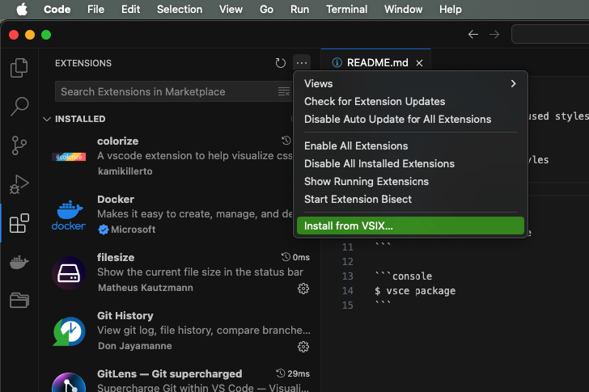

### Remove Unused Styles
> Automatically removes unused styles in React Native components.

## Usage
- extension.removeUnusedStyles
- shift+alt+g

## Installation



## Build
```console
$ npm install --global vsce
```

```console
$ vsce package
```


